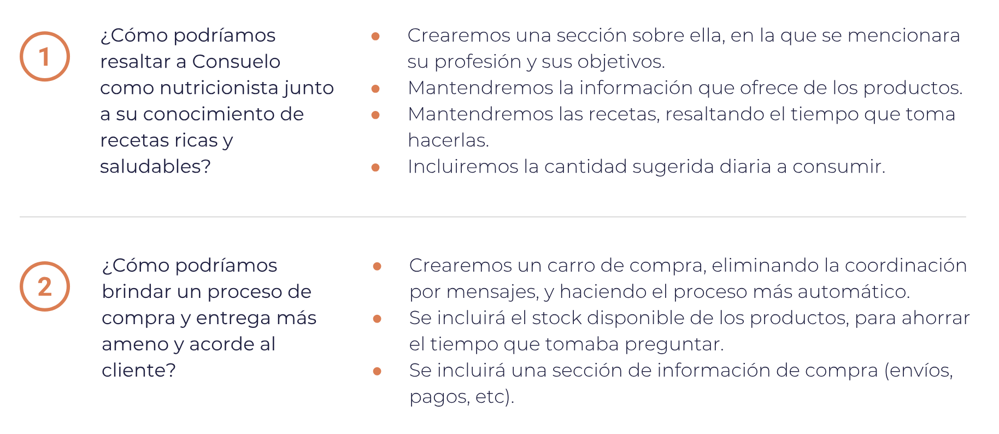
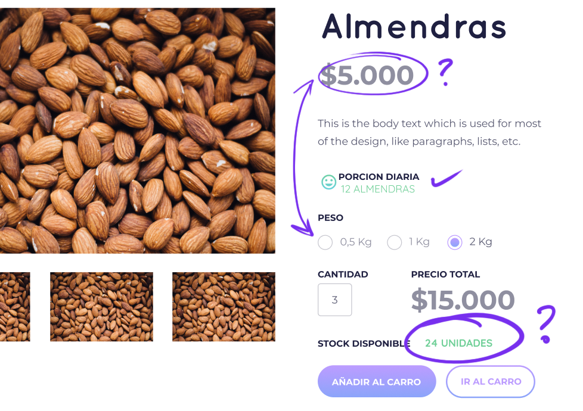
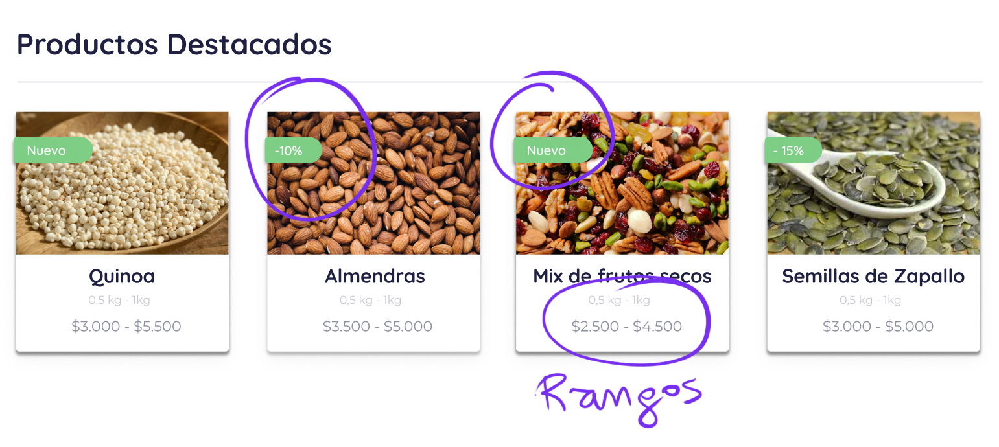
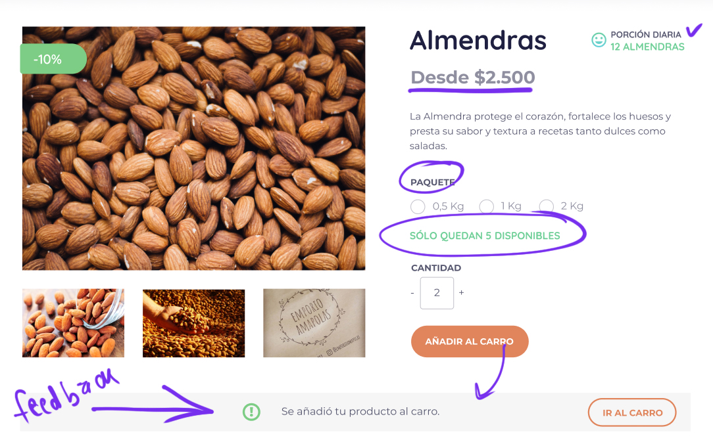
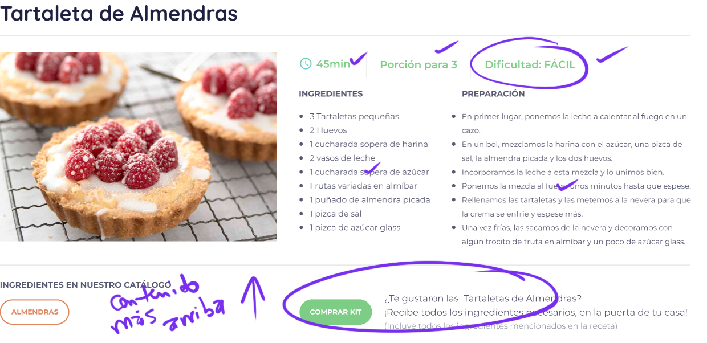

# **Marketplace Emporio Amapolas**

## **Preámbulo** 
Actualmente en Chile existe una mayor demanda por productos que requieran un menor tiempo de preparación y que sean fáciles de consumir (ProChile, 2012), debido principalmente a cambios en el estilo de vida de los habitantes. Además se observa la tendencia a comer más saludable, a preocuparse por los ingredientes que contienen los alimentos, las propiedades nutritivas que aportan (ChilIndustria, 2013), y a exigir cada vez más sobre el contenido y la funcionalidad de los productos (ProChile, 2012). Influencias como el movimiento Vegano y referentes en redes sociales de alimentación saludable, han sido gatillantes en la alza de la venta y consumo de frutos secos.

## **Introducción**
A consecuencia de lo mencionado anteriormente es que ha ido en aumento este último tiempo el consumo de este tipo de alimentos, dando cabida a pequeños emprendimientos como el de Consuelo Preusser una nutricionista que promueve la alimentación saludable vendiendo frutos secos, semillas y cereales a través del Emporio Amapolas (EA) una cuenta de instagram que tiene hace ya casi un año, en la que también entrega recetas saludables utilizando los productos que vende.

## **El Desafío**
El Emporio Amapola actualmente utiliza instagram como plataforma para promocionar y vender sus productos, al ser una plataforma gratuita brinda la posibilidad de conectar fácilmente con posibles clientes y evaluar la factibilidad de un negocio con poca inversión y de manera rápida, pero al crecer el volumen de ventas tanto el proceso de venta como el de compra pueden ser mejorados ampliamente con el fin de brindar una mejor experiencia.

## **Objetivo del proyecto**
Los objetivos de este proyecto se enmarcan en la búsqueda de la solución más idónea para nuestra cliente Consuelo Preusser y sus usuarios, para esto realizaremos un proceso de investigación, ideación y posterior testeo para llegar finalmente al desarrollo de prototipos funcionales. Es por medio de este proceso que ahondaremos en las problemáticas específicas en cada caso y trabajaremos en propuestas que aprovechen estas necesidades para sacar todo el potencial del Emporio Amapolas.

## **Definición del producto**
El marketplace de Emporio Amapolas reúne un catálogo productos, información sobre los beneficios de su consumo, porciones diarias recomendadas, recetas saludables en las que se indica su nivel de dificultad, el tiempo de duración de estas y un carrito de compra. Además cuenta con una version de administración que permite administrar el stock, ingresar nuevos productos, mantener claridad acerca de los ingresos y plantearse metas de venta por mes.

# **Proceso de investigación**

## **Contexto**

Emporio Amapolas fue creado por Consuelo Preusser hace ya casi un año, ella es nutricionista y madre de 2 hijos pequeños, partió este emprendimiento como una forma de promover el consumo de frutos secos como base para una alimentación saludable, se inspiró en otra tienda por instagram que ella seguia y todo su proceso con el EA ha sido bastante experimental 
A continuación puedes revisar más detalles sobre quiénes son sus seguidores, que tipo de perfiles sigue y qué aspectos hacen que una publicación sea más exitosa en el instagram de Emporio Amapolas.

[Análisis del instagram de EA](https://docs.google.com/document/d/1LLvDtsL75AYOwp0q8whOlEDzfArTKye1I95G9FlN4Pc/edit?usp=sharing)

### **Entrevista a Consuelo Preusser**
[Aqui puedes escuchar la entrevista](https://soundcloud.com/marlene-lopez-nanco-729624906/emporioamapolas-entrevista/s-paV2c)

## **Observación contextual**

Observamos a 3 usuarios usando el instagram de Emporio Amapolas, le solicitamos explorarán los productos disponibles y luego realizarán una compra de manera ficticia y nos  contarán cómo lo harían.

Acá puedes ver las dos primeras observaciones contextuales presenciales:

[Obsevacion contextual 1](https://youtu.be/PY4M-KIDS_A)

[Obsevacion contextual 2](https://youtu.be/jNC7iLCT3pA)

## **Benchmark**
Analizamos a 9 competidores que se encuentran en el rubro de venta de frutos secos, los cuales tienen diferentes formas y volúmenes de ventas, algunos utilizan plataformas digitales y otros son más tradicionales. Aquí puedes ver una tabla comparativa con los aspectos más relevantes.

# **Definición del público objetivo**

## **User persona**
Por medio de la observación de los seguidores del EA en instagram y consultas a Consuelo definimos el perfil de usuario de EA que puedes ver a continuación.

- Busca comer más saludable.

- No tiene tiempo de ir a comprar a locales físicos.

- Quiere saber más sobre los beneficios de cada producto.

- Busca precios accesibles.

- Quiere comer cosas distintas pero no sabe cómo prepararlas.

## **Customer Journey Map**
Analizamos el proceso de compra de los clientes del EA por medio de la observación contextual y determinamos las siguientes etapas:

Como aspectos positivos:

- Aprecia ver el precio de inmediato. Evita preguntar por interno y puede decidir rapidamente.
- Las recetas llaman su atención. Le gusta ver que puede cocinar con cada producto.
- Considera útil ver los beneficios de cada producto para informarse.

Problemas identificados:
- No puede ver la disponibilidad y pierde tiempo preguntando por el stock de productos.
- Dificultad para llegar a la información de compra y despacho.
- Las compras por Instagram no le dan mucha seguridad.
- La coordinación toma tiempo al ser una conversación.
- No conoce la forma de pago hasta cuando logra coordinar.

# **Problemas identificados en la investigación** 

## **Problemática de la clienta**
Consuelo se enfrenta a varios problemas que se derivan del poco tiempo que tiene para destinar a su emprendimiento, ya que es mamá de 2 niños de entre 1 y 4 años. Esto hace que ella no pueda estar totalmente pendiente de todo lo que conlleva tener un emprendimiento: 
- No puede publicar en instagram de forma tan periódica como quisiera
- No actualiza el excel en el que lleva la gestión de ingresos cada vez que realiza una nueva venta
- No tiene claridad sobre su inventario, ya que no actualiza regularmente su disponibilidad de stock 
- Todo lo anterior conlleva a que no tenga claridad acerca de sus ganancias mensuales con exactitud.

## **Problemática de los usuarios de EA**

Por otra parte los usuarios que prefieren comprar productos por medio de plataformas online lo hacen por razones muy claras:
- Tiempo: con el ajetreado ritmo de vida que llevamos actualmente cualquier herramienta u opción que brinde la posibilidad de aprovechar de mejor nuestro tiempo es bienvenida
- La comodidad: una de las cosas que más valoran los usuarios es la posibilidad de recibir sus compras en la puerta de su hogar.
- La rapidez: actualmente existen diferentes servicios que ofrecen entrega de productos, cada día un paso más cerca de la inmediatez
- Incluyen un sistema de pago seguro la mayoría de las veces
- Cuando ya conocen un producto no sienten necesario ir a una tienda por él, prefieren recibirlo evitar en casa directamente y así evitar lugares con mucha gente.

# **Proceso de Ideación** 

## **Aprendizajes**
En esta primera etapa comenzamos anotando todo lo que aprendimos en el proceso de investigación. Luego los agrupamos por temas y posteriormente los volvimos a agrupar por temas en común, proceso que nos llevó a enteneder distintas problemáticas anteriormente planteadas. 

## **Insights**

Aprendizajes más relevantes que logramos identificar.

## **¿Cómo podríamos?**
Entendiendo cuáles son los problemas del Emporio Amapolas, puedimos plantearnos el cómo podriamos resolver estos problemas.

## **Lluvia de ideas** 
Ya teniendo nuestras interrogantes, pudimos comenzar a pensar en cómo resolveríamos los problemas planteados, con una lluvia de ideas. Las siguientes imágenes corresponden a las ideas destacadas.

# **Objetivos de Diseño**

Con nuestras ideas definidas, en esta primera etapa decidimos efocarnos en las problemáticas realacionadas al usuario y desarrollar un marketplace de uso intuitivo, fácil y eficiente, que promueva una buena experiencia de compra a los usuarios, entregándoles toda la información que necesitan y esperan al momento de realizar una compra, evitando pasos innecesarios con el fin de que sea un proceso eficaz. 

El Marketplace contará con las siguientes características:

--------------------
En una siguiente etapa nos enfocaremos en la problematica de Consuelo. Planteamos la siguiente solución:
- Auto-administrable permitiendo a nuestra cliente gestionar todo desde un mismo lugar, llevar un inventario claro en el que pueda agregar nuevos productos, se indique el stock disponible al usuario, notifique cada compra e indique los despachos que debe realizar cada día haciendo más eficaz su tiempo en administración de EA, a su vez permitiendo que pueda dedicarse a crear contenido y subir recetas saludables.

# **Proceso de Diseño**

## **Mapa de flujo**
Diseñamos un mapa de flujo para determinar la estructuración y jerarquía de nuestro contenido de la página.
Se definieron como puntos importantes del contenido: 
- **Barra de Navegación:** Estático, que muestre todas las catergorías de la página.
  - Sección de Productos y sus subcategorías.
  - Sección de Recetas.
  - Sección "Sobre mí".
  - Sección de preguntas frecuentes.
  - Carrito de compra.
- **Carrusel de fotos de recetas:** Para mostrar de forma inmediata el contenido que más llama la atención.
- **Buscador:** Para los usuarios que vayan por un producto específico.
- **Listado de productos destacados:** Ya sea productos nuevos o en oferta, que sean mostrados en la página de inicio.

## **Diseño del Wireframe**

Diseñamos la estructuración de nuestra página con un primer Wireframe, el que además fue testeado con usuarios reales.

## **Testeo del Wireframe**

Acá puedes ver uno de los [Testeo del Wireframe.](https://youtu.be/TLz3eaF30aE)

Los testeos de usabilidad nos entregaron el siguiente feedback:
- La posición del buscado no es la más adecuada, pareciera ser un buscador general y no de productos.
- Al usuario le interesaba ver productos en oferta más que destacados.
- Ver la porción sugerida como "gr" (gramos) los confundía. Prefería medidas más comunes.
- Le parece interesante ver las recetas que se pueden hacer con el producto seleccionado.
- La búsqueda de recetas por filtro, le parece sobrecargada.
- El filtro de recetas "POR DIFICULTAD" y "POR TIEMPO" le parecen similares. Una receta fácil, generalmente toma poco tiempo.
- Se propone un kit de ingredientes de una receta para no tener que comprar todos los ingredientes por separado. Considera la propuesta interesante, pero no la entiende por si mismo.
- Entiende la información del producto.

----------------------------
## **Diseño de la Maqueta**

Ya teniendo los resultados del testeo de Usabilidad de nuestro Wireframe, procedimos a diseñar la maqueta de nuestro prototipo. 
La maqueta muestra el contenido propuesto, y posee la estructuración y jerarquización planteadas en el mapa de flujo y en el Wireframe. 

Esta máqueta incluye interacción básica, para realizar testeos. Puedes ver la 
[Demo aqui](https://www.figma.com/proto/fCVmKSlQkjrEVZpyQcoKRpfx/Emporio-Amapola-Wireframe?node-id=44%3A949&viewport=-15705%2C2704%2C1.44637&scaling=min-zoom)

## **Testeo de la Maqueta** 
Se realizaron 5 testeos de la maqueta, los cuales puedes verlos aquí:
[Testeo 1](https://www.useloom.com/share/9a5ada8a3bea47a0ba233efab539797b),
[Testeo 2](https://www.useloom.com/share/87782a06658c41d982a021c8c1a29310),
[Testeo 3](https://www.useloom.com/share/2b8001eca77744dcb41efa569fea1e40),
[Testeo 4](https://www.useloom.com/share/b25d2b829d3e41f2b93d4290face5871),
[Testeo 5](https://www.useloom.com/share/bc12134c9c7c4049a12109d22def9178).

Estos testeos nos entregaron los siguientes resultados:

- En el stock disponible del producto, hablar de "UNIDADES" confunde al usuario.
Además el precio puesto al producto corresponde sólo a uno de los "PESOS" disponibles.

- Ver la porción diaria sugerida es de gran ayuda para el usuario, quien generalmente las consume sin saber la porción sugerida.
- La opción "PESO" es confusa, piensa que es venta al granel y luego la opción cantidad lo confunde aún más.

- La opción de comprar el "KIT", se encuentra muy abajo, y pasa desapercibida. Además el usuario aún no logra entender del todo de que se trata.

- Filtrar las recetas por ingrediente es una interacción que el usuario comprende fácilmente.
- Filtrar las recetas por tiempo no tiene un buen recibimiento. Se nos sugiere en varias ocaciones cambiar a un filtro por "DIFICULTAD".

- La porción diaria de la receta es confusa.
- Todo el resto del contenido es comprensible y aceptado.

----------------------------

## **Diseño de Prototipo de Alta fidelidad**

### **¿Cómo los contenidos y funcionalidades resuelven cada uno de las necesidades del usuario final?**

Los contenidos más relevantes en esta primera etapa son:
- Visualización de los productos; desde que el usuario ingresa a la página puede apreciar algunos de los productos del EA, en tarjetas con una fotografía de buena calidad que indican los formatos de tamaños disponibles y los rangos de precio, al hacer clic en una tarjeta ingresamos al detalle del producto,encontrando información como la porción recomendada por día, beneficios del producto, los formatos disponibles y sugerencias de recetas para preparar con el producto.
- El flujo de compra; el usuario puede seleccionar el tipo de formato de su compra (cantidad de kg), a partir de esta selección indicará la cantidad de stock disponible, dándole la posibilidad de escoger la cantidad de productos que quiere comprar indicando inmediatamente al costado el valor que tendrá esta compra, indicando en todo momento el valor que tendrá su compra. Si le da en agregar al carro, en el navbar se indica el valor de total de los productos y la cantidad de estos. Al ir al carro de compra se muestran los productos seleccionados con posibilidad de eliminar alguno si se quiere y en el costado derecho se indica el total de la compra y las opciones de envío disponibles, cuentan con un  tooltip con detalles de cada una de la opciones.

>Puedes ver la [demo del Prototipo aqui](https://www.figma.com/proto/T9gsNtSmbffga3cREwk65ngH/Prototipo-navegable-EA?scaling=min-zoom)

### **Detalle del contenido del Prototipo de Alta fidelidad**

- Aplicamos a la maqueta la estética del Emporio Amapolas usada en Instagram. Usamos el color del logo para los botones y, carro de compras y el Footer.

- Dentro de los productos destacados, incluimos además de los productos nuevos, las ofertas de la semana. Se aplicó un color contrastante al base.
- Dentro de las tarjetas de los productos se agregaron rangos de peso y de precio.

- Se mantuvo la porción diaria de consumo sugerida.
- Se cambió el texto del precio a "DESDE $..." para indicar que los precios pueden variar dependiendo del paquete seleccionado.
- Se cambió la palabra "PESO" por "PAQUETE" para indicar que la venta no es al granel.
- Se agregó el stock del producto, al elegir un tipo de paquete, para que el usuario sepa de inmediato la disponibilidad.
- Al añadir al carro, se da un feedback inmediato que deja saber al usuario que fue añadido con éxito.

- El carro de compra contiene globos de pregunta que llevan a más información sobre los tipos de envío en caso de que el usuario necesite esa información. 

- Se mantiene el filtro por ingredientes
- Se cambió el filtro de "TIEMPO" por "DIFICULTAD DE PREPARACIÓN".

 
- Se agregó la etiqueta de "DIFICULTAD".
- Se subió el contenido de "COMPRAR KIT" para que fuera más visible.

- Fue incluida una sección "SOBRE MÍ", donde Consuelo habla de quién es y cuál es su visión. Esto para que los usuario puedan saber sobre su hostoria

## **Testeo Prototipo de Alta fidelidad**
Acá puedes ver nuestro [Primer testeo](https://www.useloom.com/share/963711cf68e24507b78bdcf42ab5c1d6)

## **Otros contenidos**

[Revisa nuestro video explicando el proceso del proyecto aqui](https://youtu.be/Ti6wz03O-bA)

[Aqui puede revisar la carpeta donde se contiene todo el proceso de investigación](https://drive.google.com/drive/folders/1osX3sd7BJ2ZVJ7C60uSWzxfccQ5Br5rj?usp=sharing)

