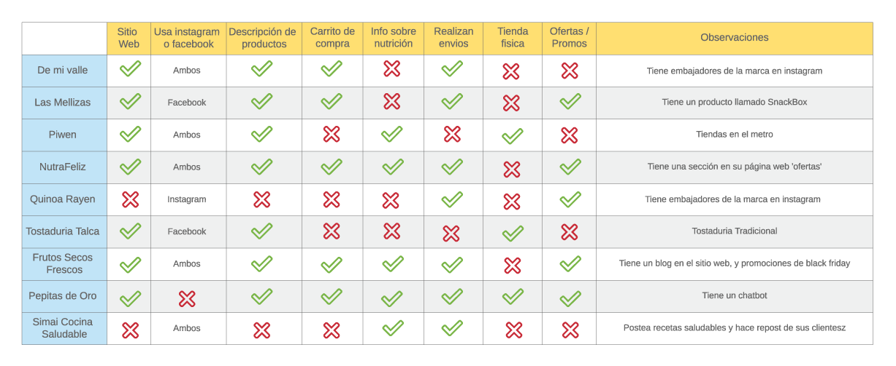
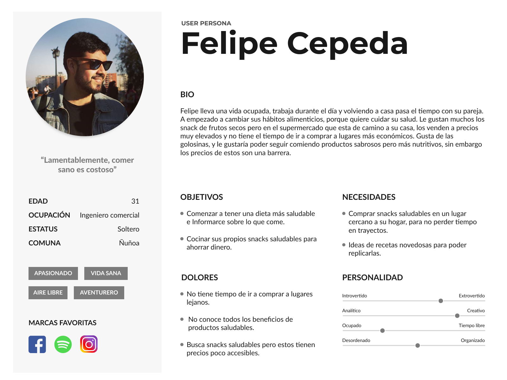
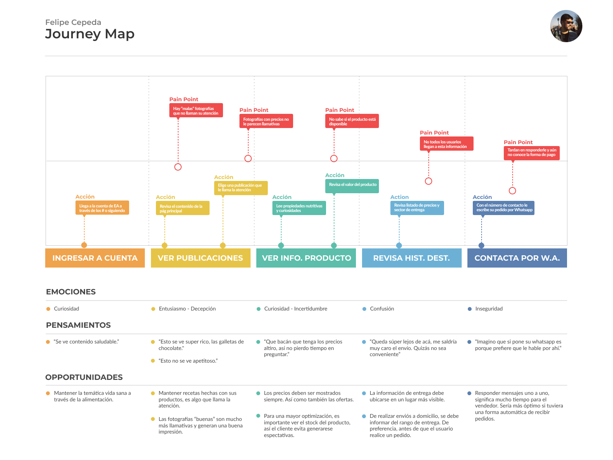
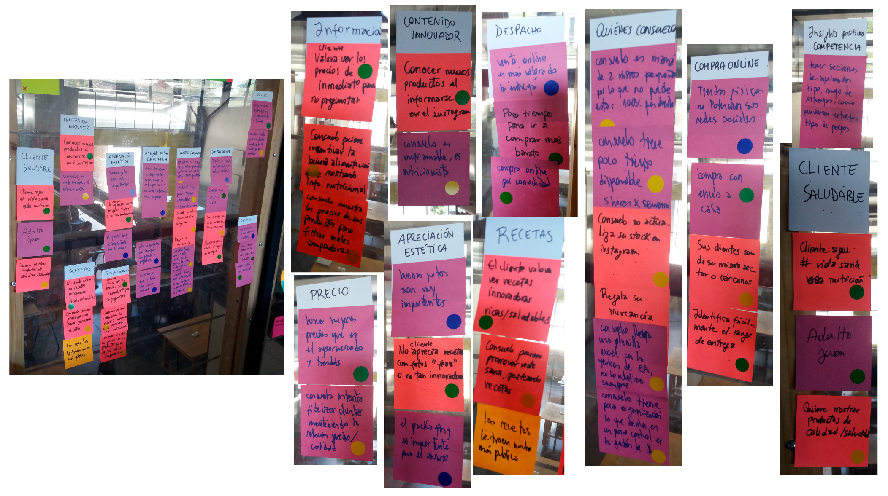
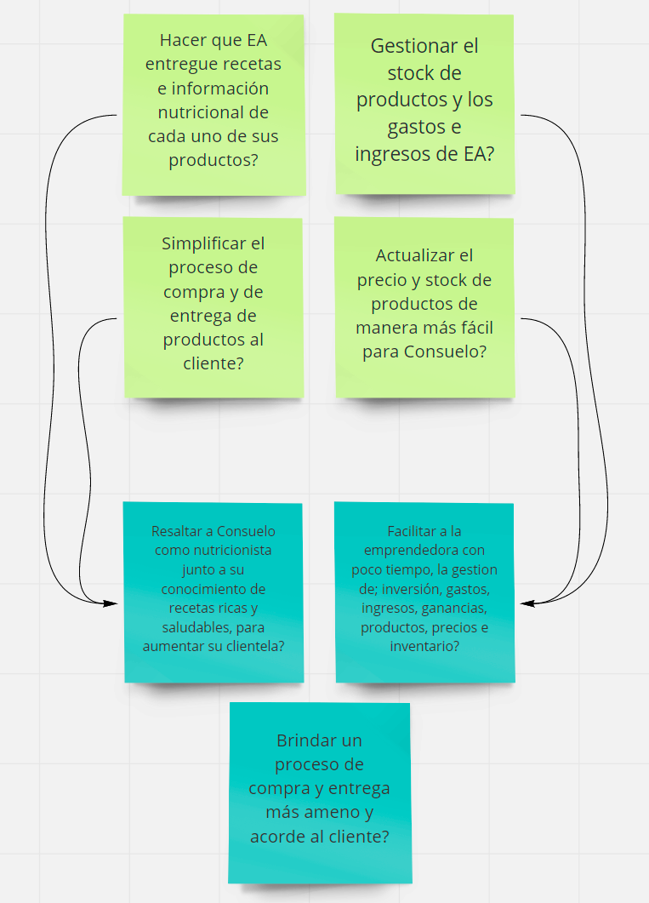
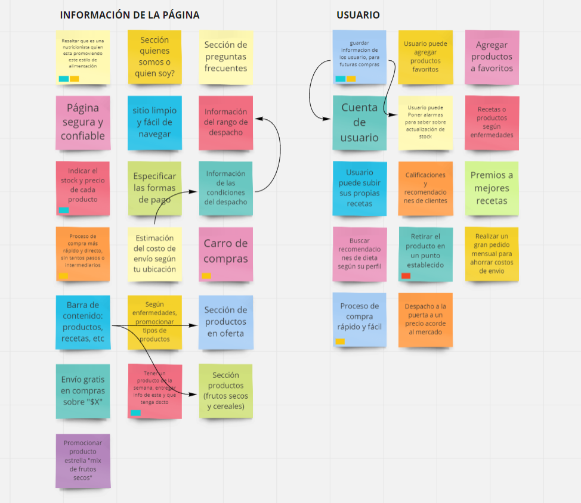
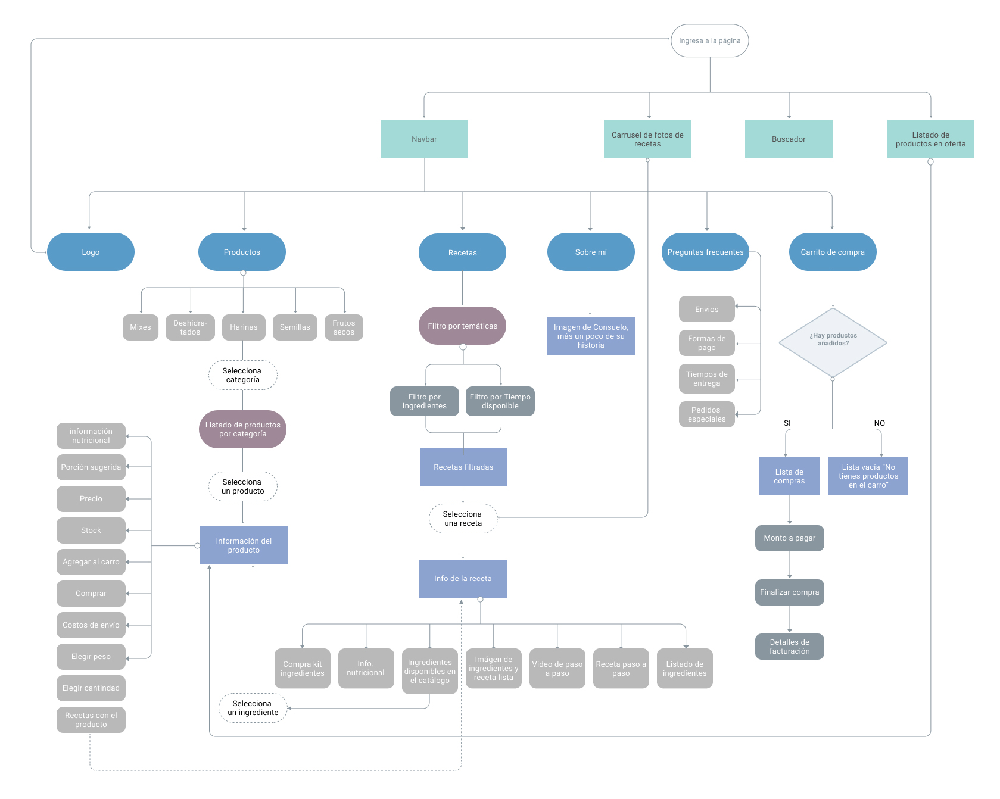
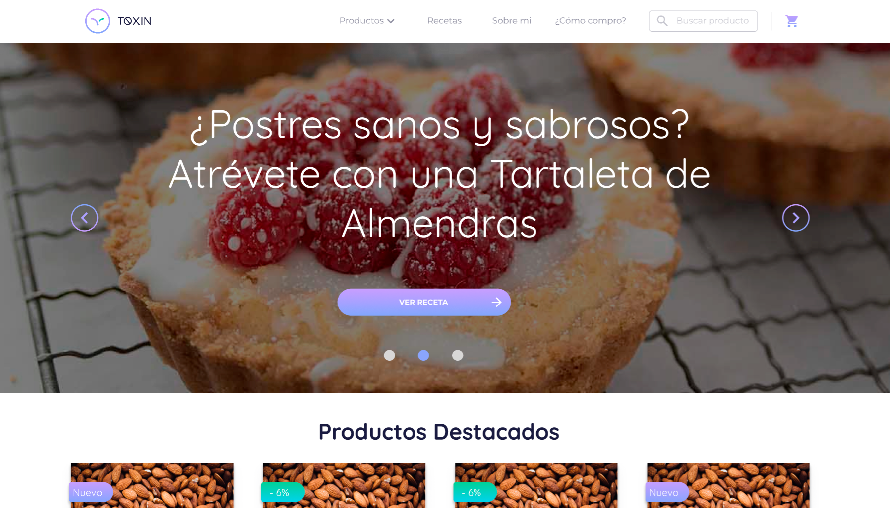
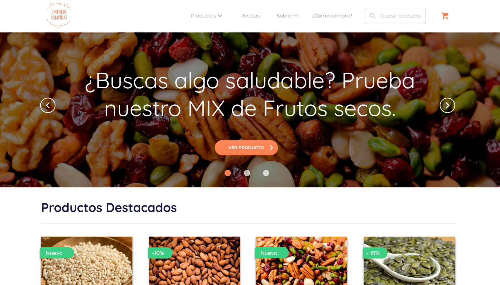

# Marketplace

## Preámbulo 
Actualmente en Chile existe una mayor demanda por productos que requieran un menor tiempo de preparación y que sean fáciles de consumir (ProChile, 2012), debido principalmente a cambios en el estilo de vida de los habitantes. Además se observa la tendencia a comer más saludable, a preocuparse por los ingredientes que contienen los alimentos, las propiedades nutritivas que aportan (ChilIndustria, 2013), y a exigir cada vez más sobre el contenido y la funcionalidad de los productos (ProChile, 2012). Influencias como el movimiento Vegano y referentes en redes sociales de alimentación saludable, han sido gatillantes en la alza de la venta y consumo de frutos secos.

## Introducción
A consecuencia de lo mencionado anteriormente es que ha ido en aumento este último tiempo el consumo de este tipo de alimentos, dando cabida a pequeños emprendimientos como el de Consuelo Preusser una nutricionista que promueve la alimentación saludable vendiendo frutos secos, semillas y cereales a través del Emporio Amapolas (EA) una cuenta de instagram que tiene hace ya casi un año, en la que también entrega recetas saludables utilizando los productos que vende.

## El desafío
El Emporio Amapola actualmente utiliza instagram como plataforma para promocionar y vender sus productos, al ser una plataforma gratuita brinda la posibilidad de conectar fácilmente con posibles clientes y evaluar la factibilidad de un negocio con poca inversión y de manera rápida, pero al crecer el volumen de ventas tanto el proceso de venta como el de compra pueden ser mejorados ampliamente con el fin de brindar una mejor experiencia.

## Objetivo del proyecto
Los objetivos de este proyecto se enmarcan en la búsqueda de la solución más idónea para nuestra cliente Consuelo Preusser y sus usuarios, para esto realizaremos un proceso de investigación, ideación y posterior testeo para llegar finalmente al desarrollo de prototipos funcionales. Es por medio de este proceso que ahondaremos en las problemáticas específicas en cada caso y trabajaremos en propuestas que aprovechen estas necesidades para sacar todo el potencial del Emporio Amapolas.

## Definición del producto
El marketplace de Emporio Amapolas reúne un catálogo productos, información sobre los beneficios de su consumo, porciones diarias recomendadas, recetas saludables en las que se indica su nivel de dificultad, el tiempo de duración de estas y un carrito de compra. Además cuenta con una version de administración que permite administrar el stock, ingresar nuevos productos, mantener claridad acerca de los ingresos y plantearse metas de venta por mes.

## Proceso de investigación

### Contexto

Emporio Amapolas fue creado por Consuelo Preusser hace ya casi un año, ella es nutricionista y madre de 2 hijos pequeños, partió este emprendimiento como una forma de promover el consumo de frutos secos como base para una alimentación saludable, se inspiró en otra tienda por instagram que ella seguia y todo su proceso con el EA ha sido bastante experimental 
A continuación puedes revisar más detalles sobre quiénes son sus seguidores, que tipo de perfiles sigue y qué aspectos hacen que una publicación sea más exitosa en el instagram de Emporio Amapolas.

[Análisis del instagram de EA](https://docs.google.com/document/d/1LLvDtsL75AYOwp0q8whOlEDzfArTKye1I95G9FlN4Pc/edit?usp=sharing)

### Entrevista a Consuelo Preusser

[Aqui puedes escuchar la entrevista](https://soundcloud.com/marlene-lopez-nanco-729624906/emporioamapolas-entrevista/s-paV2c)

### Observación contextual

Observamos a 3 usuarios usando el instagram de Emporio Amapolas, le solicitamos explorarán los productos disponibles y luego realizarán una compra de manera ficticia y nos  contarán cómo lo harían.

PENDIENTES EDITAR MANE

### Benchmark
Analizamos a 9 competidores que se encuentran en el rubro de venta de frutos secos, los cuales tienen diferentes formas y volúmenes de ventas, algunos utilizan plataformas digitales y otros son más tradicionales. Aquí puedes ver una tabla comparativa con los aspectos más relevantes.

### Definición del público objetivo

#### User persona
Por medio de la observación de los seguidores del EA en instagram y consultas a Consuelo definimos el perfil de usuario de EA que puedes ver a continuación.

#### Customer Journey Map
Analizamos el proceso de compra de los clientes del EA por medio de la observación contextual y determinamos las siguientes etapas:

### Problemas identificados en la investigación (del cliente y del usuario)

#### Problemática de la clienta
Consuelo se enfrenta a varios problemas que se derivan del poco tiempo que tiene para destinar a su emprendimiento, ya que es mamá de 2 niños de entre 1 y 4 años. Esto hace que ella no pueda estar totalmente pendiente de todo lo que conlleva tener un emprendimiento: 
- No puede publicar en instagram de forma tan periódica como quisiera
- No actualiza el excel en el que lleva la gestión de ingresos cada vez que realiza una nueva venta
- No tiene claridad sobre su inventario, ya que no actualiza regularmente su disponibilidad de stock 
- Todo lo anterior conlleva a que no tenga claridad acerca de sus ganancias mensuales con exactitud.

#### Problemática de los usuarios de EA

Por otra parte los usuarios que prefieren comprar productos por medio de plataformas online lo hacen por razones muy claras:
- Tiempo: con el ajetreado ritmo de vida que llevamos actualmente cualquier herramienta u opción que brinde la posibilidad de aprovechar de mejor nuestro tiempo es bienvenida
- La comodidad: una de las cosas que más valoran los usuarios es la posibilidad de recibir sus compras en la puerta de su hogar.
- La rapidez: actualmente existen diferentes servicios que ofrecen entrega de productos, cada día un paso más cerca de la inmediatez
- Incluyen un sistema de pago seguro la mayoría de las veces
- Cuando ya conocen un producto no sienten necesario ir a una tienda por él, prefieren recibirlo evitar en casa directamente y así evitar lugares con mucha gente.

### Proceso de Ideación 

#### Aprendizajes agrupados por temas

#### Insights

#### ¿Cómo podríamos?

#### Lluvia de ideas 

##### Mejores ideas

### Objetivos de Diseño

Desarrollaremos un marketplace que cuente con las siguientes características; 

- Auto-administrable permitiendo a nuestra cliente gestionar todo desde un mismo lugar, llevar un inventario claro en el que pueda agregar nuevos productos, se indique el stock disponible al usuario, notifique cada compra e indique los despachos que debe realizar cada día haciendo más eficaz su tiempo en administración de EA, a su vez permitiendo que pueda dedicarse a crear contenido y subir recetas saludables.

- De uso intuitivo, fácil y eficiente, que promueva una buena experiencia de compra a los usuarios, entregándoles toda la información que necesitan y esperan al momento de realizar una compra, evitando pasos innecesarios con el fin de que sea un proceso eficaz. 

- Incluiremos la sección “Recetas” en la que se sugieren algunas preparaciones usando los productos que vende EA esto debido a que es uno de los puntos fuertes de contenido en el instagram y también la sección “¿Cómo compro?” donde se explican detalladamente las formas de pago, los diferentes tipos de envío, los plazos de entrega y el retiro en tienda.

#### Mapa de flujo

### Wireframe y resultados del testeo

### Maqueta 

[Demo aqui](https://www.figma.com/proto/fCVmKSlQkjrEVZpyQcoKRpfx/Emporio-Amapola-Wireframe?node-id=44%3A949&viewport=-15705%2C2704%2C1.44637&scaling=min-zoom)

#### Testeos maqueta 

[1](https://www.useloom.com/share/9a5ada8a3bea47a0ba233efab539797b)
[2](https://www.useloom.com/share/87782a06658c41d982a021c8c1a29310)
[3](https://www.useloom.com/share/2b8001eca77744dcb41efa569fea1e40)
[4](https://www.useloom.com/share/b25d2b829d3e41f2b93d4290face5871)
[5](https://www.useloom.com/share/bc12134c9c7c4049a12109d22def9178)

### Prototipo 

[Demo aqui](https://www.figma.com/proto/T9gsNtSmbffga3cREwk65ngH/Prototipo-navegable-EA?scaling=min-zoom)

#### Testeo Prototipo Alta fidelidad
[1er testeo](https://www.useloom.com/share/963711cf68e24507b78bdcf42ab5c1d6)

### Explicación de cómo los contenidos y funcionalidades responden a los objetivos del proyecto.

En esta primera etapa trabajamos centradas en la problemática de los clientes del Emporio Amapolas.
Los contenidos que escogimos para implementar en la página fueron en base a los aprendizaje logrados en la observación contextual de usuarios realizando una compra a EA por medio de instagram, entendiendo cuáles eran sus pasos lógicos para llegar a una tarea en específico y además tomamos como referencia algunas de las mejores características de los competidores con el fin de entregar la experiencia de compra más idónea a usuarios que por tiempo prefieren realizar compras online. 

### Explicación de cómo los contenidos y funcionalidades resuelven cada uno de las necesidades del usuario final.

Los contenidos más relevantes en esta primera etapa son;
- Visualización de los productos; desde que el usuario ingresa a la página puede apreciar algunos de los productos del EA, en tarjetas con una fotografía de buena calidad que indican los formatos de tamaños disponibles y los rangos de precio, al hacer clic en una tarjeta ingresamos al detalle del producto,encontrando información como la porción recomendada por día, beneficios del producto, los formatos disponibles y sugerencias de recetas para preparar con el producto.
- El flujo de compra; el usuario puede seleccionar el tipo de formato de su compra (cantidad de kg), a partir de esta selección indicará la cantidad de stock disponible, dándole la posibilidad de escoger la cantidad de productos que quiere comprar indicando inmediatamente al costado el valor que tendrá esta compra, indicando en todo momento el valor que tendrá su compra. Si le da en agregar al carro, en el navbar se indica el valor de total de los productos y la cantidad de estos. Al ir al carro de compra se muestran los productos seleccionados con posibilidad de eliminar alguno si se quiere y en el costado derecho se indica el total de la compra y las opciones de envío disponibles, cuentan con un  tooltip con detalles de cada una de la opciones.

### Otros contenidos

[Revisa nuestro video explicando el proceso del proyecto aqui]()

[Aqui puede revisar la carpeta donde se contiene todo el proceso de investigación](https://drive.google.com/drive/folders/1osX3sd7BJ2ZVJ7C60uSWzxfccQ5Br5rj?usp=sharing)
